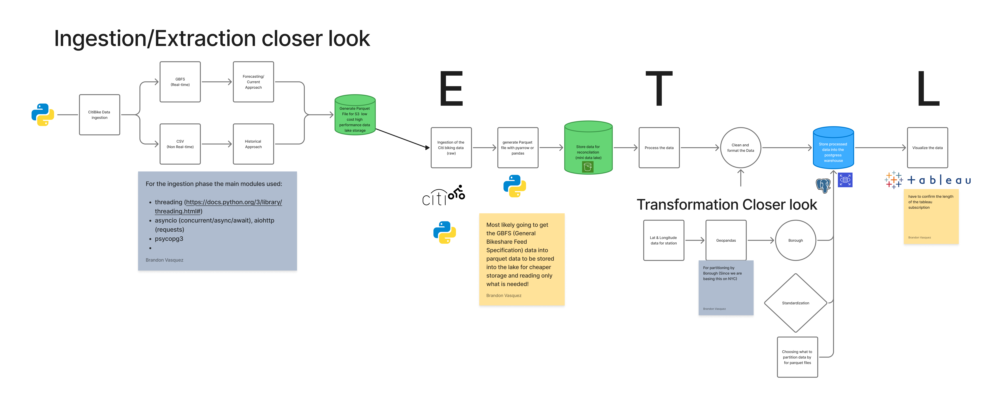

# Cyclelytics
Turning bike-share data into insights with lightweight cloud pipelines and an intuitive dashboard.

## What is Cyclelytics?
Cyclelytics is a data and analytics starter for bike-share systems. Inspired by public mobility analytics projects like NYC Citi Bike reports and Chicago Divvy data deep-dives, it wraps modern extract-transform-load (ETL) patterns with a clear place to stage a dashboard and documentation.

## Highlights
- End-to-end flow: extract raw trip data, transform for quality and usability, and load curated tables ready for BI.
- Readable modular code: `src/extract`, `src/transform`, and `src/load` mirror the pipeline stages.
- Future dashboard: reserved gallery space for KPI snapshots, route maps, and trend visuals.
- Docs-first mindset: architecture notes and screenshots live in `docs/` to keep data decisions transparent.

## Repository Layout
- `main.py` – orchestration entrypoint for running the pipeline.
- `config.py` – central configuration for sources, destinations, and toggles.
- `src/extract/` – pull raw datasets (e.g., bike trips, station metadata).
- `src/transform/` – clean, enrich, and aggregate for reporting.
- `src/load/` – write curated outputs to your warehouse, lake, or local files.
- `docs/` – architecture notes, design decisions, and (future) screenshots.
- `docs/dashboard_images/` – placeholder folder for dashboard captures.

## Getting Started
1) **Prerequisites**: Python 3.9+ and [uv](https://docs.astral.sh/uv/).
2) **Install dependencies**: `uv sync`
3) **Configure**: update `config.py` with source locations (local paths or cloud buckets) and destinations.
4) **Run the pipeline**: `uv run --active python main.py`

## AWS Credentials Configuration

### ⚠️ CRITICAL SECURITY WARNING
**NEVER hardcode AWS credentials directly in your code or configuration files.** Exposing your `aws_access_key_id` and `aws_secret_access_key` in plaintext creates serious security risks, including unauthorized access to your AWS resources, data breaches, and unexpected charges.

### What NOT to Do
❌ **Never** hardcode credentials in source code  
❌ **Never** commit credentials to version control (Git, GitHub, etc.)  
❌ **Never** include credentials in configuration files that are tracked by Git  
❌ **Never** share credentials via email, chat, or other insecure channels

### AWS Official Resources for Secure Credential Management

AWS provides comprehensive documentation on how to properly configure and manage your credentials. Please refer to these official AWS resources to learn the recommended approaches:

#### Primary Resources
- **AWS Boto3 Credentials Guide** (Essential Reading):  
  [https://boto3.amazonaws.com/v1/documentation/api/latest/guide/credentials.html](https://boto3.amazonaws.com/v1/documentation/api/latest/guide/credentials.html)  
  This guide covers all supported methods for configuring credentials, including configuration files, environment variables, IAM roles, and the credential provider chain.

- **AWS Security Best Practices for IAM**:  
  [https://docs.aws.amazon.com/IAM/latest/UserGuide/best-practices.html](https://docs.aws.amazon.com/IAM/latest/UserGuide/best-practices.html)  
  Learn about IAM roles, least-privilege access, and rotating credentials.

- **AWS CLI Configuration and Credential File Settings**:  
  [https://docs.aws.amazon.com/cli/latest/userguide/cli-configure-files.html](https://docs.aws.amazon.com/cli/latest/userguide/cli-configure-files.html)  
  Details on setting up credential and config files for local development.

#### For Production Environments
- **AWS Secrets Manager**:  
  [https://docs.aws.amazon.com/secretsmanager/latest/userguide/intro.html](https://docs.aws.amazon.com/secretsmanager/latest/userguide/intro.html)  
  Securely store and automatically rotate credentials.

- **Using IAM Roles for Amazon EC2**:  
  [https://docs.aws.amazon.com/AWSEC2/latest/UserGuide/iam-roles-for-amazon-ec2.html](https://docs.aws.amazon.com/AWSEC2/latest/UserGuide/iam-roles-for-amazon-ec2.html)  
  Eliminate the need for long-term credentials on EC2 instances.

- **AWS Systems Manager Parameter Store**:  
  [https://docs.aws.amazon.com/systems-manager/latest/userguide/systems-manager-parameter-store.html](https://docs.aws.amazon.com/systems-manager/latest/userguide/systems-manager-parameter-store.html)  
  Store configuration data and credentials centrally.

#### Additional Security Resources
- **AWS Well-Architected Framework - Security Pillar**:  
  [https://docs.aws.amazon.com/wellarchitected/latest/security-pillar/welcome.html](https://docs.aws.amazon.com/wellarchitected/latest/security-pillar/welcome.html)

- **Managing Access Keys for IAM Users**:  
  [https://docs.aws.amazon.com/IAM/latest/UserGuide/id_credentials_access-keys.html](https://docs.aws.amazon.com/IAM/latest/UserGuide/id_credentials_access-keys.html)

Before running this pipeline, ensure you have properly configured your AWS credentials following the guidance in the resources above.

## Pipeline Overview
- **Extract**: ingest raw trips and station reference data into a landing zone.
- **Transform**: standardize timestamps, compute trip durations, derive demand features, and build station/day aggregates.
- **Load**: publish curated tables for BI tools (CSV/parquet or warehouse tables, depending on `config.py`).

## Dashboard Showcase (coming soon)
- Add snapshots to `docs/dashboard_images/` (e.g., `dashboard_images/ridership_trends.png`).
- Reference them here once available:
	- Daily ridership trends – _pending screenshot_
	- Peak-hour utilization map – _pending screenshot_
	- Station reliability scorecard – _pending screenshot_

## Documentation Screenshots (coming soon)
- Use `docs/` for architecture diagrams, sequence charts, or modeling notes.
- Current capture:
  
- Add more captures like sequence diagrams or data model glossaries in `docs/` and link them here.

## Roadmap
- Add sample datasets and a reproducible demo run.
- Wire a simple warehouse target (e.g., DuckDB, Postgres, or BigQuery).
- Publish starter SQL for BI models.
- Ship a starter dashboard (Power BI, Looker, or Superset) and link images above.

## References and Inspiration
- Citi Bike public data explorations (NYC Open Data community)
- Chicago Divvy system analytics (Divvy open data community)
- Modern data stack ETL patterns from open-source mobility projects

## Contributing
Issues and pull requests are welcome. Feel free to propose new transforms, loaders, or dashboard ideas that showcase operational and rider experience insights.
